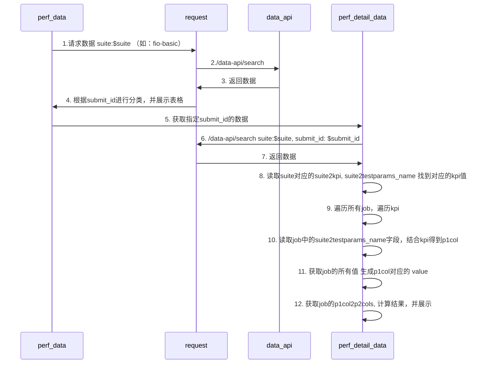

[TOC]

## 1. 需求分析：

### 1.1 需求链接

https://r.huaweistatic.com/s/kunpengstatic/lst/files/pdf/ecosystem/ecology_remit/20220630170008.pdf

### 1.2 功能描述
> 性能基线/性能测试页面：用户在网页左侧导航栏上选择基础性能（CPU/内存/存储/网络/基础库）中一个特性，右侧实现某个测试组件所有的测试数据展示
> 对比检索页面：

### 1.3 功能原型设计

https://modao.cc/app/IUs90Nvri8odsTP3U18oR#screen=sl82p1aoqxqf18o

## 2. 方案设计

### 2.1 整体方案分析


### 2.2 详细设计

#### 2.2.1 新增、修改、删除点分析
> web-backend: 新增用于标准化POST数据的模块，前端只选择suite名称，会展示全部的数据
> es-server: 新增专门用于存储数据的表单
> web-backend：基于新增的存储性能数据的表单，修改query_field数据筛选按钮的反馈
> web-backend: 修改原有对比检索页面，反馈的数据格式，新增对单个表单的几何平均值的数据反馈

#### 2.2.2 API设计

|序号|接口|页面模块|说明|
|:----    |:---|:----- |-----   |
| 1|数据上传申请的列表接口（用户看自己的，管理员看相关的）| 用户中心-我的申请-待审批(待审批/已发布/已驳回) | 查看我的申请的所有待审批的数据 |
| 2|删除数据上传申请| 用户中心-我的申请-待审批 | 删除数据上传申请 |
| 3|数据上传申请提交接口| 用户中心-我的审批-待审批(待审批/已发布/已驳回) | 审批通过待审批通过的数据 |
| 4|数据上传申请审核接口| 性能测试-测试组件-上传 | 数据上传需要绑定审核人，增加数据描述 |
| 5| 测试任务列表数据接口，可条件查询 | 测试任务 | 页面等同性能基线(一个task_id=submit_id, 一个submit_id=group of job_id) + 动态数据：总计/成功/失败 |
| 6| 测试任务详情接口 | 测试任务-详情 | 对search到的job进行全部展开 |
| 7| 性能测试详情接口 | 性能测试-详情 | 一条数据的详情 |
| 8| 删除测试任务接口 | 测试任务 | 调用接口对后端的job 进行cancel， 对于已经消费的job，无法调用该接口|
| 9| 重新运行测试任务接口 | 测试任务 | 调用接口对后端的job 进行重新提交，重跑重新跳转到任务提交页面，进行任务提交，配置复用，重新分配submit_id|
| 10| 提交测试接口 | 提交测试 | 根据前端post上来的数据，在后端组成job.yaml文件，进行任务提交 |
| 11| 获取测试套件下有哪些测试用例的接口（提交测试时要选择测试用例） | 提交测试 | 根据每个测试组件的yaml文件进行划分 |
| 12| OS版本数据接口| 提交测试 | 提交测试时选择OS版本 |
| 13| 提交测试时的硬件 | 提交测试 | 提交测试时选择硬件配置 |

##### 简要描述（数据上传申请的列表接口）

-数据上传申请的列表接口（用户看自己的，管理员看相关的）,页面模块：用户中心-所有审批，该接口用于查询当前所在的数据对象的操作权限，包括是否可编辑，删除等

######  请求URL
- ` /data-api/search`
  
######  请求方式
- GET

###### 参数

|参数名|必选|类型|说明|
|:----    |:---|:----- |-----   |
| token|是  | string | 判断账号信息 |

###### 返回示例 

``` 
{
    "count": 1,
    "next": null,
    "previous": null,
    "results": [
        {
            "guid": "AF20221126169651",
            "histories": [
                {
                    "guid": 88,
                    "who": "",
                    "when": "2022-11-26T02:49:19.519740Z",
                    "do_what": "Review",
                    "comment": "test",
                    "flow": "AF20221126169651"
                }
            ],
            "created_date": "2022-11-26T02:49:19.501471Z",
            "committed_date": "2022-11-26T02:49:19.519508Z",
            "state": "OnReview",
            "secret_level": "benchmark_performance_data",
            "data_type": "core_casedata",
            "data_description": "test",
            "data_ids": [
                "888012a6-8db0-45ac-ad73-5bfbaeb93293",
                "d9f24f62-510a-49b5-aa93-ab24f9213751",
                "cba6307e-5f13-40b2-8e06-48d3ff891054",
                "46ae558d-171b-4a2e-9e64-62673085adc4",
                "e3778a70-07f0-4c12-8162-e8af177715b0",
                "3c260c26-e43e-4d1a-865f-5062d1f7751c",
                "38b0ce72-ea14-47db-af6a-b7f5f5548a60",
                "6d8761ff-dc65-4d1d-9095-70aef9bd310d",
                "b828f655-b3c7-4f24-92ed-678a3382bf95",
                "a7bcc5ec-ae21-49b0-9933-fbcc8cf36a09"
            ],
            "publish_type": "performance_baseline_data", (等同于版本特性)
            "committed_by": "",
            "reviewer": "",
            "approvable_data": {
                "domain_type": "OPENEULER_BASIC",
                "test_model": "unixbench"
            }
        }
    ]
}
```

###### 返回参数说明 


|参数名|类型|说明|
|:-----  |:-----|-----                           |
|guid | string  |申请单号  |
|histories | string  |申请单的创建记录 |
|created_date | date  | 创建时间  |
|committed_date | date  | 提交时间 |
|state | string | 状态 |
|secret_level | string | 发布秘级 (枚举) |
|data_type | string | 被审批的数据类型 |
|data_description | string | 被审批的数据描述 |
|data_ids | list | 审批数据的submit_id，一般会提交多条数据 |
|publish_type | string | 数据发布类型 |
|committed_by | string | 提交人 |
|reviewer | string | 审批人 |
|approvable_data | hash | 提交数据可合入范围|
|domain_type | strting| 数据可合入领域(领域是团队的概念，先不划分领域)|
|test_model | string | 数据合入哪个测试组件|


##### 简要描述（删除数据上传申请）

- 删除数据上传申请,页面模块：用户中心-我的申请-待审批，该接口用于删除待审批的申请单。

######  请求URL
- ` /data-api/search`
  
######  请求方式
- POST

###### 参数

|参数名|必选|类型|说明|
|:----    |:---|:----- |-----   |
| guid|是  | string | 需要删除的数据的guid列表 |

###### 返回示例 

``` 
{
  "success": 0,
  "fail": 0,
  "message": "string"
}
```

###### 返回参数说明 


|参数名|类型|说明|
|:-----  |:-----|-----                           |
|success | int  | 操作成功的数据量 |
|fail | int  |操作失败的数据量 |
|message | string | 操作失败的原因  |

##### 简要描述（数据上传申请提交接口）

- 数据上传申请提交接口,页面模块：用户中心-我的审批-待审批，该接口用于审批通过申请单

######  请求URL
- ` /data-api/search`
  
######  请求方式
- POST

###### 参数

|参数名|必选|类型|说明|
|:----    |:---|:----- |-----   |
| guid|是  | string | 需要审批发布的数据的guid列表 |

###### 返回示例 

``` 
{
  "success": 0,
  "fail": 0,
  "message": "string"
}
```

###### 返回参数说明 


|参数名|类型|说明|
|:-----  |:-----|-----                           |
|success | int  | 操作成功的数据量 |
|fail | int  |操作失败的数据量 |
|message | string | 操作失败的原因  |

##### 简要描述（数据上传申请审核接口）

- 数据上传申请审核接口，页面模块：性能测试-测试组件-上传，该接口用于上传数据并自动提交申请单

######  请求URL
- ` /data-api/upload`
  
######  请求方式
- POST

###### 参数

|参数名|必选|类型|说明|
|:----    |:---|:----- |-----   |
| test_data_file|是  | excel文件 | 上传的文件 |
| reviewer|是  | string | 审批人 |
| data_type|是  | string | 申请单类型 |
| publish_type|是  | string | 发布类型 |
| data_description|是  | string | 数据描述 |

###### 返回示例 

``` 
{
  "success": 0,
  "fail": 0,
  "message": "string"
}
```

###### 返回参数说明 


|参数名|类型|说明|
|:-----  |:-----|-----                           |
|success | int  | 操作成功的数据量 |
|fail | int  |操作失败的数据量 |
|message | string | 操作失败的原因  |

##### 简要描述（测试任务列表数据接口）

- 测试任务列表数据接口，可条件查询，页面模块：测试任务，该接口页面等同性能基线(一个task_id=submit_id, 一个submit_id=group of job_id) + 动态数据：总计/成功/失败。
在性能基线页面，一个测试组件(suite: stream/unixbench/fio/lmbench/libmicro/speccpu), 数据组合流程(以stream为例)：
1、获取suite=stream 的10个不同submit_id的一组job
2、由于同一个submit_id的一组任务的硬件配置都是一样的，且存在另一个表单machine_info，需要根据testbox字段去获取这些详细的硬件配置

######  请求URL
- ` /data-api/search`
  
######  请求方式
- POST

###### 请求示例（就是根据ES的查询语句来获取就行）
- 查询一个测试组件 10 条不同submit_id不同的数据,使用数据库的去重查询语法
```
export const getsubmitidAxios = (param) => http({
    url: '/data-api/search',
    method: 'POST',
    data: {
        index: 'jobs',
        query: {
            size: 0,
            _source: ['submit_id'],
            query: {
                bool: {
                    must: [
                        {
                            match: {
                                suite: "stream"
                            },
                            exists: {
                                field: "submit_id"
                            }
                        }
                    ]
                },
                aggs: {
                    uid_aggs: {
                        terms: {
                            field: "submit_id",
                            size: 10 
                        }
                    },
                    aggs: {
                        my_top_hits: {
                            top_hits: {
                                _source: {
                                    includes: ['suite', 'submit_id', 'os', 'os_version', 'nr_cpu', 'testbox', 'kernel_version', 'nr_node', "job_stage", "job_health"]
                                }
                            }
                        }
                    }
                }
            }
        }
    }
});
```


###### 参数

|参数名|必选|类型|说明|
|:----    |:---|:----- |-----   |
| index|是  | 要查询的es表单名 | jobs这个表单中包含了后台消费的所有任务 |
| query |是  | hash | es数据库的查询语句 |
| size| 否 | int | 要返回的数据量 |
| _source | 否 | list | 要返回的字段 |
|match | 是  | hash | es数据库中的匹配查询语句 |
|aggs | 是  | hash | es数据库中的聚合查询语句 |
|terms | 是  | hash | 根据结果分类 |
|field | 是  | string | 筛选字段 |
|submit_id | 是  | string | 需要分类的字段 |

###### 返回示例 

``` 
{
    "_shards": {
        "failed": 0,
        "skipped": 0,
        "successful": 23,
        "total": 23
    },
    "aggregations": {
        "uid_aggs": {
            "buckets": [
                {
                    "doc_count": 12,
                    "key": "01a1601b-a096-488c-a00c-42f19b332a9b", # submit_id
                    "my_top_hits": {
                        "hits":{
                            "hits": [
                                {
                                    "_id": "crystal.3513587",
                                    "_index": "jobs8",
                                    "_score": 8.205667,
                                    "_source": {
                                        "suite": "stream", # 这些submit_id对应的suite都是stream
                                        "submit_id": "",
                                        "os": "openeuler",
                                        "os_version": "xxx", # os+os_version=os_release
                                        "nr_cpu": "",
                                        "testbox": "taishan200-2280-2s48p-284g--a1006",
                                        "kernel_version": "",
                                        "nr_node": 4,
                                        "job_stage": "finish",
                                        "job_health": "success"
                                    },
                                    "_type": "_doc"
                                },
                                ......
                        }
                },
                ......
            ],
            "doc_count_error_upper_bound": 12,
            "sum_other_doc_count": 1366
        }
    },
    "hits": {
        "hits": [
            ......
        ],
        "max_score": 12.896866,
        "total": {
            "relation": "eq",
            "value": 1486
        }
    },
    "timed_out": false,
    "took": 175
}

```

###### 返回参数说明 

|参数名|类型|说明|
|:-----  |:-----|-----                           |
|buckets| hash | 桶，类似于关系型数据库中的group_by |
|key | string  | 查询时所用的用于分类筛选的field |
|my_top_hits | hash | 筛选到的结果  |
|os os_version | string | 这两个字段加在一起就是os_release, 表头显示为操作系统  |
|nr_cpu | int | 等同于cpus，表头显示为CPU总核数  |
|testbox | string | 测试机名称，通过这个字段可以获取测试机的更多参数 |
|kernel_version | string | 等同于os_kernel,表头显示为系统内核 |
|nr_node | int | 表头显示为操作系统页表大小 |
|job_stage | string | 任务所处阶段，有submit(提交)，finish（完成） |
|job_health | string | 任务状况，有failed， success |

##### 简要描述（根据testbox获取测试机的更多参数）
- 根据testbox即测试机名称，获取测试机的更多参数

######  请求URL
- ` /data-api/search`
  
######  请求方式
- POST

###### 请求示例（就是根据ES的查询语句来获取就行）
- 根据testbox，去获取testbox的信息
```
export const getsubmitidAxios = (param) => http({
    url: '/data-api/search',
    method: 'POST',
    data: {
        index: 'machine_info',
        query: {
            size: 1,
            query: {
                bool: {
                    must: [
                        {
                            match: {"testbox": "taishan200-2280-2s48p-284g--a1006"}
                        }
                    ]
                }
            }
        }
    }
 }
                        
```

###### 参数

|参数名|必选|类型|说明|
|:----    |:---|:----- |-----   |
| index|是  | 要查询的es表单名 | machine_info这个表单中保存了所有测试机的详细信息 |
| query |是  | hash | es数据库的查询语句 |
| size| 否 | int | 要返回的数据量 |
| _source | 否 | list | 要返回的字段 |
|match | 是  | hash | es数据库中的匹配查询语句 |

###### 返回示例 

``` 
{
    "_shards": {
        "failed": 0,
        "skipped": 0,
        "successful": 1,
        "total": 1
    },
    "hits": {
        "hits": [
            {
                "_id": "9Fjzx4QBo5nFGu9ethdR",
                "_index": "machine_info",
                "_score": 1.0,
                "_source": {
                    "bios": {
                        "version": "1.7"
                    },
                    "cpu": {
                        "model": "Kunpeng 920-4826",
                        "num": "2"
                    },
                    "disk": {
                        "device_port": "SAS (SPL-3)",
                        "num": "9",
                        "size": "1.09 TiB",
                        "type": "hdd"
                    },
                    "memory": {
                        "num": "12",
                        "rank": "2",
                        "speed": "2666MT/s",
                        "type": "DDR4"
                    },
                    "ports": {
                        "device_num": "e51922a2e5195404",
                        "num": "2"
                    },
                    "server": {
                        "product": "TaiShan 200 (Model 2280)"
                    },
                    "testbox":"" "taishan200-2280-2s48p-384g--a1006"""
                },
                "_type": "_doc"
            }
        ],
        "max_score": 1.0,
        "total": {
            "relation": "eq",
            "value": 5
        }
    },
    "timed_out": false,
    "took": 0
}
```

###### 返回参数说明 

|参数名|类型|说明|
|:-----  |:-----|-----      |
|bios| hash | BIOS版本 |
|cpu | hash | num*model = CPU配置 |
|disk| hash | num*size device_port type = 硬盘配置 |
|memory | hash | num*32GB rankR type speed = 内存配置 |
|ports | hash |   |
|server | hash | product = 服务器型号 |

##### 简要描述（测试任务详情接口）
- 测试任务详情接口，测试任务-详情，对search到的job进行全部展开

######  请求URL
- ` /data-api/search`
  
######  请求方式
- POST

###### 请求示例（就是根据ES的查询语句来获取就行）
- 根据submit_id，拿到一组job的信息
```
export const getsubmitidAxios = (param) => http({
    url: '/data-api/search',
    method: 'POST',
    data: {
        index: jobs
        query: {
            size: 10000，#取到这个submit中的所有的job
            query: {
                bool: {
                    must: [
                        {
                            term: {
                                submit_id: param.submit_id
                            }
                        }
                    ]
                }
            }
        },
        sort: [
            submit_time: {
                order: desc
            }
        ],
        _source: ["suite", "submit_id", "my_account", "submit_time", "boot_time", "close_time", "job_stage", "job_health", "testbox", "category", "result_root"]
    }
})
                        
```

###### 参数

|参数名|必选|类型|说明|
|:----    |:---|:----- |-----   |
| index|是  | 要查询的es表单名 | machine_info这个表单中保存了所有测试机的详细信息 |
| query |是  | hash | es数据库的查询语句 |
| size| 否 | int | 要返回的数据量 |
| sort| 否 | hash | 用来排序的字段 |
| _source | 否 | list | 要返回的字段 |

###### 返回示例 

``` 
{
    "_shards": {
        "failed": 0,
        "skipped": 0,
        "successful": 1,
        "total": 1
    },
    "hits": {
        "hits": [
            {
                "_id": "9Fjzx4QBo5nFGu9ethdR",
                "_index": "machine_info",
                "_score": 1.0,
                "_source": {
                   "suite": "stream",
                   "submit_id": "",
                   "my_account": "",
                   "submit_time": "",
                   "boot_time": "",
                   "close_time": "",
                   "job_stage": "",
                   "job_health": "",
                   "testbox": "",
                   "category": "",
                   "result_root": "",    
                },
                "_type": "_doc"
            }
        ],
        "max_score": 1.0,
        "total": {
            "relation": "eq",
            "value": 5
        }
    },
    "timed_out": false,
    "took": 0
}
```

###### 返回参数说明 

|参数名|类型|说明|
|:-----  |:-----|-----      |
|suite| string | Test Suite |
|submit_id | string | 详情页索id|
|my_account | string | 任务提交人|
|submit_time| string | 任务提交时间 |
|boot_time | string | 任务开始时间 |
|close_time | string | 任务完成时间 |
|job_stage | string | 任务所处阶段，有submit(提交)，finish（完成） |
|job_health | string | 任务状况，有failed， success |
|testbox | string | 机器|
|category | string | 测试类型（benchmark表示性能测试） |
|result_root | string | 结果日志的下载路径 |

##### 简要描述（性能测试详情接口）

- 性能测试详情接口，性能测试-详情，对性能测试页面的一条数据进行完全展开

|基础性能基线|测试组件|
|:----- |-----      |
|CPU|unixbench|
||speccpu2006|
||speccpu2017|
|内存|stream|
||lmbench|
|存储|fio|
||iozone(暂不支持)|
|网络|netperf|
|基础库|libmicro|
||specjvm2008(暂不支持)|

######  请求URL
- ` /data-api/search`
  
######  请求方式
- POST

###### 请求示例（就是根据ES的查询语句来获取就行）
- 根据submit_id，拿到一组job，同时，根据不同suite的表格划分不一致，依据配置文件进行详情页面的表格组合

###### 测试套数据分析
下面这张表格将8个测试组件的，不同表格结构展示出来了，有些测试组件，展示效果上，需要展示出多张表格，因为其有不同的测试用例，例如，lmbench有6张表格。
组合规则：

```
p1：
    page1 cols
    hw-param1,2,3,   os-param1,2,3, test-params-p1, kpi-name, kpi-value
    性能测试页面，每一行的数据来自同一个submit_id, 一个submit_id是一组job(原子级的)的组id， 一组job，还需组合成多个表格，即： job和表格之间是多对多的关系。
p2:
    page2 cols
    test-params-p2+kpi-name, kpi-value
    性能测试-详情页面，对每个表格的数据进行展开，需要给出列名（column name），实际上大部分的列名或来自于不同的test-params，例如：pp.netperf.send_size。或来自于kpi（key performance indicators），例如unixbench。

rules
- 1 atomic job=1 test run
- 1 atomic job => N KPI (show in N line)
- M atomic jobs with equal params = repeated M runs => N KPI average (show in N line)
- some params (bs) should be merged into 1 line in page1, then show in expanded lines in page2

test definitions:

- user friendly param kv name (nr_task=1: 单核   nr_task=100%: 多核  rw=read: 读)
- user friendly KPI name 
- p1 param
- p2 param
- other params will be silently united and values averaged, not shown anywhere
   
test_params(p1)：
    用于从大量job中筛选，划分表格数据的参数，实际上，os(操作系统)、os_arch(架构)、testbox(机器)也属于test_params(p1)，由于篇幅原因，就不在表格中展开，且这些参数，同一个submit_id下，一般都是一样的，直接通过submit_id 就够了。

    group by submit_id ==> all jobs of suite
    if test_params(p1) not the same:
        not in one table
        group by (pp.unixbench.nr_task=1) ==> table(单核)
        group by (pp.unixbench.nr_task=96)  ==> table(多核)

column name(p2):
    用于划分表格的表头, 一般取自kpi,或者test_params(p1) 

search fio jobs
for each job (fio)
  kpis = suite2kpis[job.suite]
  for each kpi in kpis (fio.read_iops, fio.read_bw_MBps, fio.write_bw_MBps, fio.write_iops)
	job.p1cols = page1-cols (hw-param1,2,3, os-param1,2,3, test-params-p1-values, kpi-name)
    use test_params(p1) as key:
    {
        pp.fio-setup-basic.rw=randrw,pp.fio-setup-basic.rwmixread=70,pp.fio-setup-basic.bs=4k: {
            fio.read_iops: ["34325", "7264"],
            fio.read_bw_MBps: [],
            fio.write_bw_MBps: [],
            fio.write_iops: [],
        },
        pp.fio-setup-basic.rw=randrw,pp.fio-setup-basic.rwmixread=70,pp.fio-setup-basic.bs=16k: {
            fio.read_iops: ["34325", "7264"]
            fio.read_bw_MBps: []
            fio.write_bw_MBps: []
            fio.write_iops: []
        },
        ....
    } ==> split by kpi (fio.read_iops,fio.read_bw_MBp,fio.write_bw_MBps,fio.write_iops), generate 4 tables

	job.p2cols = page2-cols (test-params-p2-values+kpi-name)
	p1_lines[job.p1cols].jobs.append job
	p1_lines[job.p1cols].values.append kpi-value (job[stats.$kpi])
	p1_lines[job.p1cols].tablecols ||=  **user friendly names**[hw-param1,2,3,   os-param1,2,3, test-params-p1, kpi-name]
	p1_lines[job.p1cols].p2_lines[p2cols].append **user friendly names**[test-params-p2+kpi-name, kpi-value]
        
```

|测试组件|表格名(等同于测试用例)|test_parmas(p1)|table column name(p2)|kpi|
|:-----  |:-----|:-----|:-----|----- |
|	stream	|	Function	|	pp.stream.nr_threads=96,pp.stream.array_size=100000000,pp.stream.omp=false	|	copy	|	stream.copy_bandwidth_MBps 	|
|		|		|	pp.stream.nr_threads=96,pp.stream.array_size=100000000,pp.stream.omp=false	|	triad	|	stream.triad_bandwidth_MBps 	|
|		|		|	pp.stream.nr_threads=96,pp.stream.array_size=100000000,pp.stream.omp=false	|	add	|	stream.add_bandwidth_MBps 	|
|		|		|	pp.stream.nr_threads=96,pp.stream.array_size=100000000,pp.stream.omp=false	|	scale	|	stream.scale_bandwidth_MBps 	|
|	unixbench	|	单核	|	pp.unixbench.nr_task=1	|	Dhrystone_2_using_register_variables	|	unixbench.Dhrystone_2_using_register_variables	|
|		|		|	pp.unixbench.nr_task=1	|	Double-Precision_Whetstone	|	unixbench.Double-Precision_Whetstone	|
|		|		|	pp.unixbench.nr_task=1	|	Execl_Throughput	|	unixbench.Execl_Throughput	|
|		|		|	pp.unixbench.nr_task=1	|	File_Copy_1024_bufsize_2000_maxblocks	|	 unixbench.File_Copy_1024_bufsize_2000_maxblocks	|
|		|		|	pp.unixbench.nr_task=1	|	File_Copy_256_bufsize_500_maxblocks	|	unixbench.File_Copy_256_bufsize_500_maxblocks	|
|		|		|	pp.unixbench.nr_task=1	|	File_Copy_4096_bufsize_8000_maxblocks	|	unixbench.File_Copy_4096_bufsize_8000_maxblocks	|
|		|		|	pp.unixbench.nr_task=1	|	Pipe_Throughput	|	unixbench.Pipe_Throughput	|
|		|		|	pp.unixbench.nr_task=1	|	Pipe-based_Context_Switching	|	unixbench.Pipe-based_Context_Switching	|
|		|		|	pp.unixbench.nr_task=1	|	Process_Creation	|	unixbench.Process_Creation"	|
|		|		|	pp.unixbench.nr_task=1	|	Shell_Scripts_(1_concurrent)	|	unixbench.Shell_Scripts_(1_concurrent)	|
|		|		|	pp.unixbench.nr_task=1	|	Shell_Scripts_(8_concurrent)	|	unixbench.Shell_Scripts_(8_concurrent)	|
|		|		|	pp.unixbench.nr_task=1	|	System_Call_Overhead	|	unixbench.System_Call_Overhead	|
|		|		|	pp.unixbench.nr_task=1	|	System_Benchmarks_Index_Score	|	unixbench.System_Benchmarks_Index_Score	|
|		|	多核	|	pp.unixbench.nr_tas=96(不一定，根据机器规格还有128核的)	|	Dhrystone_2_using_register_variables	|	unixbench.Dhrystone_2_using_register_variables	|
|		|		|	pp.unixbench.nr_task=96	|	Double-Precision_Whetstone	|	unixbench.Double-Precision_Whetstone	|
|		|		|	pp.unixbench.nr_task=96	|	Execl_Throughput	|	unixbench.Execl_Throughput	|
|		|		|	pp.unixbench.nr_task=96	|	File_Copy_1024_bufsize_2000_maxblocks	|	 "unixbench.File_Copy_1024_bufsize_2000_maxblocks	|
|		|		|	pp.unixbench.nr_task=96	|	File_Copy_256_bufsize_500_maxblocks	|	unixbench.File_Copy_256_bufsize_500_maxblocks	|
|		|		|	pp.unixbench.nr_task=96	|	File_Copy_4096_bufsize_8000_maxblocks	|	unixbench.File_Copy_4096_bufsize_8000_maxblocks	|
|		|		|	pp.unixbench.nr_task=96	|	Pipe_Throughput	|	unixbench.Pipe_Throughput	|
|		|		|	pp.unixbench.nr_task=96	|	Pipe-based_Context_Switching	|	unixbench.Pipe-based_Context_Switching	|
|		|		|	pp.unixbench.nr_task=96	|	Process_Creation	|	unixbench.Process_Creation	|
|		|		|	pp.unixbench.nr_task=96	|	Shell_Scripts_(1_concurrent)	|	unixbench.Shell_Scripts_(1_concurrent)	|
|		|		|	pp.unixbench.nr_task=96	|	Shell_Scripts_(8_concurrent)	|	unixbench.Shell_Scripts_(8_concurrent)	|
|		|		|	pp.unixbench.nr_task=96	|	System_Call_Overhead	|	unixbench.System_Call_Overhead	|
|		|		|	pp.unixbench.nr_task=96	|	System_Benchmarks_Index_Score	|	unixbench.System_Benchmarks_Index_Score	|
|	netperf	|	TCP_STREAM	|	 pp.netperf.test=TCP_STREAM,pp.netperf.send_size=1,64,128,256,512,1024,1500,2048,4096,9000,16384,32768	|	1,64,128,256,512,1024,1500,2048,4096,9000,16384,32768	|	netperf.Throughput_tps	|
|		|	UDP_STREAM	|	pp.netperf.test=UDP_STREAM,pp.netperf.send_size=1,64,128,256,512,1024,1500,2048,4096,9000,16384,32768	|	1,64,128,256,512,1024,1500,2048,4096,9000,16384,32768	|	netperf.Throughput_tps	|
|		|	Protocol_kind	|	 pp.netperf.test=TCP_RR,UDP_RR,TCP_CRR	|	TCP_RR,UDP_RR,TCP_CRR	|	netperf.Throughput_tps	|
|	lmbench	|	Processor_Processes	|	pp.lmbench.mode=all,pp.lmbench.nr_thread=1,pp.lmbench.test_memory_size=4096	|	syscall.syscall.latency.us	|	lmbench.syscall.syscall.latency.us	|
|		|		|	pp.lmbench.mode=all,pp.lmbench.nr_thread=1,pp.lmbench.test_memory_size=4096	|	syscall.stat.latency.us	|	lmbench.syscall.stat.latency.us	|
|		|		|	pp.lmbench.mode=all,pp.lmbench.nr_thread=1,pp.lmbench.test_memory_size=4096	|	syscall.open/close.latency.us	|	lmbench.syscall.open/close.latency.us	|
|		|		|	pp.lmbench.mode=all,pp.lmbench.nr_thread=1,pp.lmbench.test_memory_size=4096	|	null_io	|	lmbench.null_io	|
|		|		|	pp.lmbench.mode=all,pp.lmbench.nr_thread=1,pp.lmbench.test_memory_size=4096	|	Process.fork+exit.latency.us	|	lmbench.Process.fork+exit.latency.us	|
|		|		|	pp.lmbench.mode=all,pp.lmbench.nr_thread=1,pp.lmbench.test_memory_size=4096	|	Process.fork+execve.latency.us	|	lmbench.Process.fork+execve.latency.us	|
|		|		|	pp.lmbench.mode=all,pp.lmbench.nr_thread=1,pp.lmbench.test_memory_size=4096	|	Process.fork+/bin/sh.latency.us	|	lmbench.Process.fork+/bin/sh.latency.us	|
|		|		|	pp.lmbench.mode=all,pp.lmbench.nr_thread=1,pp.lmbench.test_memory_size=4096	|	Select.100tcp.latency.us	|	lmbench3.Select.100tcp.latency.us	|
|		|		|	pp.lmbench.mode=all,pp.lmbench.nr_thread=1,pp.lmbench.test_memory_size=4096	|	sig_inst	|	lmbench.sig_inst	|
|		|		|	pp.lmbench.mode=all,pp.lmbench.nr_thread=1,pp.lmbench.test_memory_size=4096	|	sig_hndl	|	lmbench.sig_hndl	|
|		|	local_latencies	|	pp.lmbench.mode=all,pp.lmbench.nr_thread=1,pp.lmbench.test_memory_size=4096	|	PIPE.latency.us	|	lmbench.PIPE.latency.us	|
|		|		|	pp.lmbench.mode=all,pp.lmbench.nr_thread=1,pp.lmbench.test_memory_size=4096	|	AF_UNIX.sock.stream.latency.us	|	lmbench.AF_UNIX.sock.stream.latency.us	|
|		|		|	pp.lmbench.mode=all,pp.lmbench.nr_thread=1,pp.lmbench.test_memory_size=4096	|	UDP.usinglocalhost.latency.us	|	lmbench.UDP.usinglocalhost.latency.us	|
|		|		|	pp.lmbench.mode=all,pp.lmbench.nr_thread=1,pp.lmbench.test_memory_size=4096	|	TCP.localhost.latency	|	lmbench.TCP.localhost.latency	|
|		|		|	pp.lmbench.mode=all,pp.lmbench.nr_thread=1,pp.lmbench.test_memory_size=4096	|	CONNECT.localhost.latency.us	|	lmbench.CONNECT.localhost.latency.us	|
|		|	local_bandwidths	|	pp.lmbench.mode=all,pp.lmbench.nr_thread=1,pp.lmbench.test_memory_size=4096	|	PIPE.bandwidth.MB/sec	|	lmbench.PIPE.bandwidth.MB/sec	|
|		|		|	pp.lmbench.mode=all,pp.lmbench.nr_thread=1,pp.lmbench.test_memory_size=4096	|	AF_UNIX.sock.stream.bandwidth.MB/sec	|	lmbench.AF_UNIX.sock.stream.bandwidth.MB/sec	|
|		|		|	pp.lmbench.mode=all,pp.lmbench.nr_thread=1,pp.lmbench.test_memory_size=4096	|	TCP.socket.bandwidth.10MB.MB/sec	|	lmbench.TCP.socket.bandwidth.10MB.MB/sec	|
|		|		|	pp.lmbench.mode=all,pp.lmbench.nr_thread=1,pp.lmbench.test_memory_size=4096	|	FILE.read.bandwidth.MB/sec	|	lmbench.FILE.read.bandwidth.MB/sec	|
|		|		|	pp.lmbench.mode=all,pp.lmbench.nr_thread=1,pp.lmbench.test_memory_size=4096	|	MMAP.read.bandwidth.MB/sec	|	lmbench.MMAP.read.bandwidth.MB/sec	|
|		|		|	pp.lmbench.mode=all,pp.lmbench.nr_thread=1,pp.lmbench.test_memory_size=4096	|	BCOPY.libc.bandwidth.MB/sec	|	lmbench.BCOPY.libc.bandwidth.MB/sec	|
|		|		|	pp.lmbench.mode=all,pp.lmbench.nr_thread=1,pp.lmbench.test_memory_size=4096	|	BCOPY.unrolled.bandwidth.MB/sec	|	lmbench.BCOPY.unrolled.bandwidth.MB/sec	|
|		|		|	pp.lmbench.mode=all,pp.lmbench.nr_thread=1,pp.lmbench.test_memory_size=4096	|	BCOPY.memory_read.bandwidth.MB/sec	|	lmbench.BCOPY.memory_read.bandwidth.MB/sec	|
|		|		|	pp.lmbench.mode=all,pp.lmbench.nr_thread=1,pp.lmbench.test_memory_size=4096	|	BCOPY.memory_write.bandwidth.MB/sec	|	lmbench.BCOPY.memory_write.bandwidth.MB/sec	|
|		|	Context_switching_ctxsw	|	pp.lmbench.mode=all,pp.lmbench.nr_thread=1,pp.lmbench.test_memory_size=4096	|	CTX.2P.0K.latency.us	|	lmbench.CTX.2P.0K.latency.us	|
|		|		|	pp.lmbench.mode=all,pp.lmbench.nr_thread=1,pp.lmbench.test_memory_size=4096	|	CTX.2P.16K.latency.us	|	lmbench.CTX.2P.16K.latency.us	|
|		|		|	pp.lmbench.mode=all,pp.lmbench.nr_thread=1,pp.lmbench.test_memory_size=4096	|	CTX.2P.64K.latency.us	|	lmbench.CTX.2P.64K.latency.us	|
|		|		|	pp.lmbench.mode=all,pp.lmbench.nr_thread=1,pp.lmbench.test_memory_size=4096	|	CTX.8P.16K.latency.us	|	lmbench.CTX.8P.16K.latency.us	|
|		|		|	pp.lmbench.mode=all,pp.lmbench.nr_thread=1,pp.lmbench.test_memory_size=4096	|	CTX.8P.64K.latency.us	|	lmbench.CTX.8P.64K.latency.us	|
|		|		|	pp.lmbench.mode=all,pp.lmbench.nr_thread=1,pp.lmbench.test_memory_size=4096	|	CTX.16P.16K.latency.us	|	lmbench.CTX.16P.16K.latency.us	|
|		|		|	pp.lmbench.mode=all,pp.lmbench.nr_thread=1,pp.lmbench.test_memory_size=4096	|	CTX.16P.64K.latency.us	|	lmbench.CTX.16P.64K.latency.us	|
|		|	File_&_VM_latencies	|	pp.lmbench.mode=all,pp.lmbench.nr_thread=1,pp.lmbench.test_memory_size=4096	|	Mmap_Latency	|	lmbench.Mmap_Latency	|
|		|		|	pp.lmbench.mode=all,pp.lmbench.nr_thread=1,pp.lmbench.test_memory_size=4096	|	Prot_Fault	|	lmbench.Prot_Fault	|
|		|		|	pp.lmbench.mode=all,pp.lmbench.nr_thread=1,pp.lmbench.test_memory_size=4096	|	Pagefaults.ms	|	lmbench.Pagefaults.ms	|
|		|		|	pp.lmbench.mode=all,pp.lmbench.nr_thread=1,pp.lmbench.test_memory_size=4096	|	Select.100fd.latency.us	|	lmbench.Select.100fd.latency.us	|
|		|	Memory_latencies	|	pp.lmbench.mode=all,pp.lmbench.nr_thread=1,pp.lmbench.test_memory_size=4096	|	L1_$	|	lmbench.L1_$	|
|		|		|	pp.lmbench.mode=all,pp.lmbench.nr_thread=1,pp.lmbench.test_memory_size=4096	|	L2_$	|	lmbench.L2_$	|
|		|		|	pp.lmbench.mode=all,pp.lmbench.nr_thread=1,pp.lmbench.test_memory_size=4096	|	Main_mem	|	lmbench.Main_mem	|
|		|		|	pp.lmbench.mode=all,pp.lmbench.nr_thread=1,pp.lmbench.test_memory_size=4096	|	Rand_mem	|	lmbench.Rand_mem	|
|	fio	|	randrwread_iops_blocksize	|	pp.fio-setup-basic.rw=randrw,pp.fio-setup-basic.rwmixread=70,pp.fio-setup-basic.bs=4k,16k,32k,64k,128k,256k,512k,1024k	|	4k,16k,32k,64k,128k,256k,512k,1024k	|	fio.read_iops	|
|		|	randrwread_bw_blocksize	|	pp.fio-setup-basic.rw=randrw,pp.fio-setup-basic.rwmixread=70,pp.fio-setup-basic.bs=4k,16k,32k,64k,128k,256k,512k,1024k	|	4k,16k,32k,64k,128k,256k,512k,1024k	|	fio.read_bw_MBps	|
|		|	randrwwrite_iops_blocksize	|	pp.fio-setup-basic.rw=randrw,pp.fio-setup-basic.rwmixread=70,pp.fio-setup-basic.bs=4k,16k,32k,64k,128k,256k,512k,1024k	|	4k,16k,32k,64k,128k,256k,512k,1024k	|	fio.write_iops	|
|		|	randrwwrite_bw_blocksize	|	pp.fio-setup-basic.rw=read,pp.fio-setup-basic.rwmixread=70,pp.fio-setup-basic.bs=4k,16k,32k,64k,128k,256k,512k,1024k	|	4k,16k,32k,64k,128k,256k,512k,1024k	|	fio.write_bw_MBps	|
|		|	read_iops_blocksize	|	pp.fio-setup-basic.rw=read,pp.fio-setup-basic.bs=4k,16k,32k,64k,128k,256k,512k,1024k	|	4k,16k,32k,64k,128k,256k,512k,1024k	|	fio.read_iops	|
|		|	read_bw_blocksize	|	pp.fio-setup-basic.rw=read,pp.fio-setup-basic.bs=4k,16k,32k,64k,128k,256k,512k,1024k	|	4k,16k,32k,64k,128k,256k,512k,1024k	|	fio.read_bw_MBps	|
|		|	randread_iops_blocksize	|	pp.fio-setup-basic.rw=randread,pp.fio-setup-basic.bs=4k,16k,32k,64k,128k,256k,512k,1024k	|	4k,16k,32k,64k,128k,256k,512k,1024k	|	fio.read_iops	|
|		|	randread_bw_blocksize	|	pp.fio-setup-basic.rw=randread,pp.fio-setup-basic.bs=4k,16k,32k,64k,128k,256k,512k,1024k	|	4k,16k,32k,64k,128k,256k,512k,1024k	|	fio.read_bw_MBps	|
|		|	write_iops_blocksize	|	pp.fio-setup-basic.rw=write,pp.fio-setup-basic.bs=4k,16k,32k,64k,128k,256k,512k,1024k	|	4k,16k,32k,64k,128k,256k,512k,1024k	|	fio.write_iops	|
|		|	write_bw_blocksize	|	pp.fio-setup-basic.rw=write,pp.fio-setup-basic.bs=4k,16k,32k,64k,128k,256k,512k,1024k	|	4k,16k,32k,64k,128k,256k,512k,1024k	|	fio.write_bw_MBps	|
|		|	randwrite_iops_blocksize	|	pp.fio-setup-basic.rw=randwrite,pp.fio-setup-basic.bs=4k,16k,32k,64k,128k,256k,512k,1024k	|	4k,16k,32k,64k,128k,256k,512k,1024k	|	fio.write_iops	|
|		|	randwrite_bw_blocksize	|	pp.fio-setup-basic.rw=randwrite,pp.fio-setup-basic.bs=4k,16k,32k,64k,128k,256k,512k,1024k	|	4k,16k,32k,64k,128k,256k,512k,1024k	|	fio.write_bw_MBps	|
|	speccpu2006	|	intrate	|	pp.speccpu-2006.test_item=rate,pp.speccpu-2006.num_type=int	|	400.perlbench_Rate	|	speccpu-2006.400.perlbench_Rate	|
|		|		|	pp.speccpu-2006.test_item=rate,pp.speccpu-2006.num_type=int	|	401.bzip2_Rate	|	speccpu-2006.401.bzip2_Rate	|
|		|		|	pp.speccpu-2006.test_item=rate,pp.speccpu-2006.num_type=int	|	403.gcc_Rate	|	speccpu-2006.403.gcc_Rate	|
|		|		|	pp.speccpu-2006.test_item=rate,pp.speccpu-2006.num_type=int	|	429.mcf_Rate	|	speccpu-2006.429.mcf_Rate	|
|		|		|	pp.speccpu-2006.test_item=rate,pp.speccpu-2006.num_type=int	|	445.gobmk_Rate	|	speccpu-2006.445.gobmk_Rate	|
|		|		|	pp.speccpu-2006.test_item=rate,pp.speccpu-2006.num_type=int	|	456.hmmer_Rate	|	speccpu-2006.456.hmmer_Rate	|
|		|		|	pp.speccpu-2006.test_item=rate,pp.speccpu-2006.num_type=int	|	458.sjeng_Rate	|	speccpu-2006.458.sjeng_Rate	|
|		|		|	pp.speccpu-2006.test_item=rate,pp.speccpu-2006.num_type=int	|	462.libquantum_Rate	|	speccpu-2006.462.libquantum_Rate	|
|		|		|	pp.speccpu-2006.test_item=rate,pp.speccpu-2006.num_type=int	|	464.h264ref_Rate	|	speccpu-2006.464.h264ref_Rate	|
|		|		|	pp.speccpu-2006.test_item=rate,pp.speccpu-2006.num_type=int	|	471.omnetpp_Rate	|	speccpu-2006.471.omnetpp_Rate	|
|		|		|	pp.speccpu-2006.test_item=rate,pp.speccpu-2006.num_type=int	|	473.astar_Rate	|	speccpu-2006.473.astar_Rate	|
|		|		|	pp.speccpu-2006.test_item=rate,pp.speccpu-2006.num_type=int	|	483.xalancbmk_Rate	|	speccpu-2006.483.xalancbmk_Rate	|
|		|		|	pp.speccpu-2006.test_item=rate,pp.speccpu-2006.num_type=int	|	Est.SPECint(R)_rate_base2006	|	speccpu-2006.Est.SPECint(R)_rate_base2006	|
|		|	intspeed	|	pp.speccpu-2006.test_item=speed,pp.speccpu-2006.num_type=int	|	400.perlbench_Ratio	|	speccpu-2006.400.perlbench_Ratio	|
|		|		|	pp.speccpu-2006.test_item=speed,pp.speccpu-2006.num_type=int	|	401.bzip2_Ratio	|	speccpu-2006.401.bzip2_Ratio	|
|		|		|	pp.speccpu-2006.test_item=speed,pp.speccpu-2006.num_type=int	|	403.gcc_Ratio	|	speccpu-2006.403.gcc_Ratio	|
|		|		|	pp.speccpu-2006.test_item=speed,pp.speccpu-2006.num_type=int	|	429.mcf_Ratio	|	speccpu-2006.429.mcf_Ratio	|
|		|		|	pp.speccpu-2006.test_item=speed,pp.speccpu-2006.num_type=int	|	445.gobmk_Ratio	|	speccpu-2006.445.gobmk_Ratio	|
|		|		|	pp.speccpu-2006.test_item=speed,pp.speccpu-2006.num_type=int	|	456.hmmer_Ratio	|	speccpu-2006.456.hmmer_Ratio	|
|		|		|	pp.speccpu-2006.test_item=speed,pp.speccpu-2006.num_type=int	|	458.sjeng_Ratio	|	speccpu-2006.458.sjeng_Ratio	|
|		|		|	pp.speccpu-2006.test_item=speed,pp.speccpu-2006.num_type=int	|	462.libquantum_Ratio	|	speccpu-2006.462.libquantum_Ratio	|
|		|		|	pp.speccpu-2006.test_item=speed,pp.speccpu-2006.num_type=int	|	464.h264ref_Ratio	|	speccpu-2006.464.h264ref_Ratio	|
|		|		|	pp.speccpu-2006.test_item=speed,pp.speccpu-2006.num_type=int	|	471.omnetpp_Ratio	|	speccpu-2006.471.omnetpp_Ratio	|
|		|		|	pp.speccpu-2006.test_item=speed,pp.speccpu-2006.num_type=int	|	473.astar_Ratio	|	speccpu-2006.473.astar_Ratio	|
|		|		|	pp.speccpu-2006.test_item=speed,pp.speccpu-2006.num_type=int	|	483.xalancbmk_Ratio	|	speccpu-2006.483.xalancbmk_Ratio	|
|		|		|	pp.speccpu-2006.test_item=speed,pp.speccpu-2006.num_type=int	|	Est.SPECint(R)_base2006	|	speccpu-2006.Est.SPECint(R)_base2006	|
|		|	fpspeed	|	pp.speccpu-2006.test_item=speed,pp.speccpu-2006.num_type=fp	|	410.bwaves_Ratio	|	speccpu-2006.410.bwaves_Ratio	|
|		|		|	pp.speccpu-2006.test_item=speed,pp.speccpu-2006.num_type=fp	|	416.gamess_Ratio	|	speccpu-2006.416.gamess_Ratio	|
|		|		|	pp.speccpu-2006.test_item=speed,pp.speccpu-2006.num_type=fp	|	433.milc_Ratio	|	speccpu-2006.433.milc_Ratio	|
|		|		|	pp.speccpu-2006.test_item=speed,pp.speccpu-2006.num_type=fp	|	434.zeusmp_Ratio	|	speccpu-2006.434.zeusmp_Ratio	|
|		|		|	pp.speccpu-2006.test_item=speed,pp.speccpu-2006.num_type=fp	|	435.gromacs_Ratio	|	speccpu-2006.435.gromacs_Ratio	|
|		|		|	pp.speccpu-2006.test_item=speed,pp.speccpu-2006.num_type=fp	|	436.cactusADM_Ratio	|	speccpu-2006.436.cactusADM_Ratio	|
|		|		|	pp.speccpu-2006.test_item=speed,pp.speccpu-2006.num_type=fp	|	437.leslie3d_Ratio	|	speccpu-2006.437.leslie3d_Ratio	|
|		|		|	pp.speccpu-2006.test_item=speed,pp.speccpu-2006.num_type=fp	|	444.namd_Ratio	|	speccpu-2006.444.namd_Ratio	|
|		|		|	pp.speccpu-2006.test_item=speed,pp.speccpu-2006.num_type=fp	|	447.dealII_Ratio	|	speccpu-2006.447.dealII_Ratio	|
|		|		|	pp.speccpu-2006.test_item=speed,pp.speccpu-2006.num_type=fp	|	450.soplex_Ratio	|	speccpu-2006.450.soplex_Ratio	|
|		|		|	pp.speccpu-2006.test_item=speed,pp.speccpu-2006.num_type=fp	|	453.povray_Ratio	|	speccpu-2006.453.povray_Ratio	|
|		|		|	pp.speccpu-2006.test_item=speed,pp.speccpu-2006.num_type=fp	|	454.calculix_Ratio	|	speccpu-2006.454.calculix_Ratio	|
|		|		|	pp.speccpu-2006.test_item=speed,pp.speccpu-2006.num_type=fp	|	459.GemsFDTD_Ratio	|	speccpu-2006.459.GemsFDTD_Ratio	|
|		|		|	pp.speccpu-2006.test_item=speed,pp.speccpu-2006.num_type=fp	|	465.tonto_Ratio	|	speccpu-2006.465.tonto_Ratio	|
|		|		|	pp.speccpu-2006.test_item=speed,pp.speccpu-2006.num_type=fp	|	470.lbm_Ratio	|	speccpu-2006.470.lbm_Ratio	|
|		|		|	pp.speccpu-2006.test_item=speed,pp.speccpu-2006.num_type=fp	|	481.wrf_Ratio	|	speccpu-2006.481.wrf_Ratio	|
|		|		|	pp.speccpu-2006.test_item=speed,pp.speccpu-2006.num_type=fp	|	482.sphinx3_Ratio	|	speccpu-2006.482.sphinx3_Ratio	|
|		|		|	pp.speccpu-2006.test_item=speed,pp.speccpu-2006.num_type=fp	|	Est.SPECfp(R)_base2006	|	speccpu-2006.Est.SPECfp(R)_base2006	|
|		|	fprate	|	pp.speccpu-2006.test_item=rate,pp.speccpu-2006.num_type=fp	|	410.bwaves_Rate	|	speccpu-2006.410.bwaves_Rate	|
|		|		|	pp.speccpu-2006.test_item=rate,pp.speccpu-2006.num_type=fp	|	416.gamess_Rate	|	speccpu-2006.416.gamess_Rate	|
|		|		|	pp.speccpu-2006.test_item=rate,pp.speccpu-2006.num_type=fp	|	433.milc_Rate	|	speccpu-2006.433.milc_Rate	|
|		|		|	pp.speccpu-2006.test_item=rate,pp.speccpu-2006.num_type=fp	|	434.zeusmp_Rate	|	speccpu-2006.434.zeusmp_Rate	|
|		|		|	pp.speccpu-2006.test_item=rate,pp.speccpu-2006.num_type=fp	|	435.gromacs_Rate	|	speccpu-2006.435.gromacs_Rate	|
|		|		|	pp.speccpu-2006.test_item=rate,pp.speccpu-2006.num_type=fp	|	436.cactusADM_Rate	|	speccpu-2006.436.cactusADM_Rate	|
|		|		|	pp.speccpu-2006.test_item=rate,pp.speccpu-2006.num_type=fp	|	437.leslie3d_Rate	|	speccpu-2006.437.leslie3d_Rate	|
|		|		|	pp.speccpu-2006.test_item=rate,pp.speccpu-2006.num_type=fp	|	444.namd_Rate	|	speccpu-2006.444.namd_Rate	|
|		|		|	pp.speccpu-2006.test_item=rate,pp.speccpu-2006.num_type=fp	|	447.dealII_Rate	|	speccpu-2006.447.dealII_Rate	|
|		|		|	pp.speccpu-2006.test_item=rate,pp.speccpu-2006.num_type=fp	|	450.soplex_Rate	|	speccpu-2006.450.soplex_Rate	|
|		|		|	pp.speccpu-2006.test_item=rate,pp.speccpu-2006.num_type=fp	|	453.povray_Rate	|	speccpu-2006.453.povray_Rate	|
|		|		|	pp.speccpu-2006.test_item=rate,pp.speccpu-2006.num_type=fp	|	454.calculix_Rate	|	speccpu-2006.454.calculix_Rate	|
|		|		|	pp.speccpu-2006.test_item=rate,pp.speccpu-2006.num_type=fp	|	459.GemsFDTD_Rate	|	speccpu-2006.459.GemsFDTD_Rate	|
|		|		|	pp.speccpu-2006.test_item=rate,pp.speccpu-2006.num_type=fp	|	465.tonto_Rate	|	speccpu-2006.465.tonto_Rate	|
|		|		|	pp.speccpu-2006.test_item=rate,pp.speccpu-2006.num_type=fp	|	470.lbm_Rate	|	speccpu-2006.470.lbm_Rate	|
|		|		|	pp.speccpu-2006.test_item=rate,pp.speccpu-2006.num_type=fp	|	481.wrf_Rate	|	speccpu-2006.481.wrf_Rate	|
|		|		|	pp.speccpu-2006.test_item=rate,pp.speccpu-2006.num_type=fp	|	482.sphinx3_Rate	|	speccpu-2006.482.sphinx3_Rate	|
|		|		|	pp.speccpu-2006.test_item=rate,pp.speccpu-2006.num_type=fp	|	Est.SPECfp(R)_rate_base2006	|	speccpu-2006.Est.SPECfp(R)_rate_base2006	|
|	speccpu2017	|	intrate	|	pp.speccpu-2017.item=intrate	|	500.perlbench_r	|	speccpu-2017.500.perlbench_r	|
|		|		|	pp.speccpu-2017.item=intrate	|	502.gcc_r	|	speccpu-2017.502.gcc_r	|
|		|		|	pp.speccpu-2017.item=intrate	|	505.mcf_r	|	speccpu-2017.505.mcf_r	|
|		|		|	pp.speccpu-2017.item=intrate	|	520.omnetpp_r	|	speccpu-2017.520.omnetpp_r	|
|		|		|	pp.speccpu-2017.item=intrate	|	523.xalancbmk_r	|	speccpu-2017.523.xalancbmk_r	|
|		|		|	pp.speccpu-2017.item=intrate	|	525.x264_r	|	speccpu-2017.525.x264_r	|
|		|		|	pp.speccpu-2017.item=intrate	|	531.deepsjeng_r	|	speccpu-2017.531.deepsjeng_r	|
|		|		|	pp.speccpu-2017.item=intrate	|	541.leela_r	|	speccpu-2017.541.leela_r	|
|		|		|	pp.speccpu-2017.item=intrate	|	548.exchange2_r	|	speccpu-2017.548.exchange2_r	|
|		|		|	pp.speccpu-2017.item=intrate	|	557.xz_r	|	speccpu-2017.557.xz_r	|
|		|		|	pp.speccpu-2017.item=intrate	|	Est.SPECrate2017_int_base	|	speccpu-2017.Est.SPECrate2017_int_base	|
|		|	intspeed	|	pp.speccpu-2017.item=intspeed	|	600.perlbench_s	|	speccpu-2017.600.perlbench_s	|
|		|		|	pp.speccpu-2017.item=intspeed	|	602.gcc_s	|	speccpu-2017.602.gcc_s	|
|		|		|	pp.speccpu-2017.item=intspeed	|	605.mcf_s	|	speccpu-2017.605.mcf_s	|
|		|		|	pp.speccpu-2017.item=intspeed	|	620.omnetpp_s	|	speccpu-2017.620.omnetpp_s	|
|		|		|	pp.speccpu-2017.item=intspeed	|	623.xalancbmk_s	|	speccpu-2017.623.xalancbmk_s	|
|		|		|	pp.speccpu-2017.item=intspeed	|	625.x264_s	|	speccpu-2017.625.x264_s	|
|		|		|	pp.speccpu-2017.item=intspeed	|	631.deepsjeng_s	|	speccpu-2017.631.deepsjeng_s	|
|		|		|	pp.speccpu-2017.item=intspeed	|	641.leela_s	|	speccpu-2017.641.leela_s	|
|		|		|	pp.speccpu-2017.item=intspeed	|	648.exchange2_s	|	speccpu-2017.648.exchange2_s	|
|		|		|	pp.speccpu-2017.item=intspeed	|	657.xz_s	|	speccpu-2017.657.xz_s	|
|		|		|	pp.speccpu-2017.item=intspeed	|	Est.SPECspeed2017_int_base	|	speccpu-2017.Est.SPECspeed2017_int_base	|
|		|	fpspeed	|	pp.speccpu-2017.item=fpspeed	|	603.bwaves_s	|	speccpu-2017.603.bwaves_s	|
|		|		|	pp.speccpu-2017.item=fpspeed	|	607.cactuBSSN_s	|	speccpu-2017.607.cactuBSSN_s	|
|		|		|	pp.speccpu-2017.item=fpspeed	|	619.lbm_s	|	speccpu-2017.619.lbm_s	|
|		|		|	pp.speccpu-2017.item=fpspeed	|	621.wrf_s	|	speccpu-2017.621.wrf_s	|
|		|		|	pp.speccpu-2017.item=fpspeed	|	627.cam4_s	|	speccpu-2017.627.cam4_s	|
|		|		|	pp.speccpu-2017.item=fpspeed	|	628.pop2_s	|	speccpu-2017.628.pop2_s	|
|		|		|	pp.speccpu-2017.item=fpspeed	|	638.imagick_s	|	speccpu-2017.638.imagick_s	|
|		|		|	pp.speccpu-2017.item=fpspeed	|	644.nab_s	|	speccpu-2017.644.nab_s	|
|		|		|	pp.speccpu-2017.item=fpspeed	|	649.fotonik3d_s	|	speccpu-2017.649.fotonik3d_s	|
|		|		|	pp.speccpu-2017.item=fpspeed	|	654.roms_s	|	speccpu-2017.654.roms_s	|
|		|		|	pp.speccpu-2017.item=fpspeed	|	Est.SPECspeed2017_fp_base	|	speccpu-2017.Est.SPECspeed2017_fp_base	|
|		|	fprate	|	pp.speccpu-2017.item=fprate	|	503.bwaves_r	|	speccpu-2017.503.bwaves_r	|
|		|		|	pp.speccpu-2017.item=fprate	|	507.cactuBSSN_r	|	speccpu-2017.507.cactuBSSN_r	|
|		|		|	pp.speccpu-2017.item=fprate	|	508.namd_r	|	speccpu-2017.508.namd_r	|
|		|		|	pp.speccpu-2017.item=fprate	|	510.parest_r	|	speccpu-2017.510.parest_r	|
|		|		|	pp.speccpu-2017.item=fprate	|	511.povray_r	|	speccpu-2017.511.povray_r	|
|		|		|	pp.speccpu-2017.item=fprate	|	519.lbm_r	|	speccpu-2017.519.lbm_r	|
|		|		|	pp.speccpu-2017.item=fprate	|	521.wrf_r	|	speccpu-2017.521.wrf_r	|
|		|		|	pp.speccpu-2017.item=fprate	|	526.blender_r	|	speccpu-2017.526.blender_r	|
|		|		|	pp.speccpu-2017.item=fprate	|	527.cam4_r	|	speccpu-2017.527.cam4_r	|
|		|		|	pp.speccpu-2017.item=fprate	|	538.imagick_r	|	speccpu-2017.538.imagick_r	|
|		|		|	pp.speccpu-2017.item=fprate	|	544.nab_r	|	speccpu-2017.544.nab_r	|
|		|		|	pp.speccpu-2017.item=fprate	|	549.fotonik3d_r	|	speccpu-2017.549.fotonik3d_r	|
|		|		|	pp.speccpu-2017.item=fprate	|	554.roms_r	|	speccpu-2017.554.roms_r	|
|		|		|	pp.speccpu-2017.item=fprate	|	Est.SPECrate2017_fp_base	|	speccpu-2017.Est.SPECrate2017_fp_base	|
|	libmicro	|	Function	|	pp.libmicro	|	getpid	|	libmicro.getpid	|
|		|		|	pp.libmicro	|	getenv	|	libmicro.getenv	|
|		|		|	pp.libmicro	|	getenvT2	|	libmicro.getenvT2	|
|		|		|	pp.libmicro	|	gettimeofday	|	libmicro.gettimeofday	|
|		|		|	pp.libmicro	|	log	|	libmicro.log	|
|		|		|	pp.libmicro	|	exp	|	libmicro.exp	|
|		|		|	pp.libmicro	|	lrand48	|	libmicro.lrand48	|
|		|		|	pp.libmicro	|	memset_10	|	libmicro.memset_10	|
|		|		|	pp.libmicro	|	memset_256	|	libmicro.memset_256	|
|		|		|	pp.libmicro	|	memset_256_u	|	libmicro.memset_256_u	|
|		|		|	pp.libmicro	|	memset_1k	|	libmicro.memset_1k	|
|		|		|	pp.libmicro	|	memset_4k	|	libmicro.memset_4k	|
|		|		|	pp.libmicro	|	memset_4k_uc	|	libmicro.memset_4k_uc	|
|		|		|	pp.libmicro	|	memset_10k	|	libmicro.memset_10k	|
|		|		|	pp.libmicro	|	memset_1m	|	libmicro.memset_1m	|
|		|		|	pp.libmicro	|	memset_10m	|	libmicro.memset_10m	|
|		|		|	pp.libmicro	|	memsetP2_10m	|	libmicro.memsetP2_10m	|
|		|		|	pp.libmicro	|	memrand	|	libmicro.memrand	|
|		|		|	pp.libmicro	|	isatty_yes	|	libmicro.isatty_yes	|
|		|		|	pp.libmicro	|	isatty_no	|	libmicro.isatty_no	|
|		|		|	pp.libmicro	|	malloc_10	|	libmicro.malloc_10	|
|		|		|	pp.libmicro	|	malloc_100	|	libmicro.malloc_100	|
|		|		|	pp.libmicro	|	malloc_1k	|	libmicro.malloc_1k	|
|		|		|	pp.libmicro	|	malloc_10k	|	libmicro.malloc_10k	|
|		|		|	pp.libmicro	|	malloc_100k	|	libmicro.malloc_100k	|
|		|		|	pp.libmicro	|	mallocT2_10	|	libmicro.mallocT2_10	|
|		|		|	pp.libmicro	|	mallocT2_100	|	libmicro.mallocT2_100	|
|		|		|	pp.libmicro	|	mallocT2_1k	|	libmicro.mallocT2_1k	|
|		|		|	pp.libmicro	|	mallocT2_10k	|	libmicro.mallocT2_10k	|
|		|		|	pp.libmicro	|	mallocT2_100k	|	libmicro.mallocT2_100k	|
|		|		|	pp.libmicro	|	close_bad	|	libmicro.close_bad	|
|		|		|	pp.libmicro	|	close_tmp	|	libmicro.close_tmp	|
|		|		|	pp.libmicro	|	close_usr	|	libmicro.close_usr	|
|		|		|	pp.libmicro	|	close_zero	|	libmicro.close_zero	|
|		|		|	pp.libmicro	|	memcpy_10	|	libmicro.memcpy_10	|
|		|		|	pp.libmicro	|	memcpy_1k	|	libmicro.memcpy_1k	|
|		|		|	pp.libmicro	|	memcpy_10k	|	libmicro.memcpy_10k	|
|		|		|	pp.libmicro	|	memcpy_1m	|	libmicro.memcpy_1m	|
|		|		|	pp.libmicro	|	memcpy_10m	|	libmicro.memcpy_10m	|
|		|		|	pp.libmicro	|	strcpy_10	|	libmicro.strcpy_10	|
|		|		|	pp.libmicro	|	strchr_1k	|	libmicro.strchr_1k	|
|		|		|	pp.libmicro	|	strcmp_10	|	libmicro.strcmp_10	|
|		|		|	pp.libmicro	|	strcmp_1k	|	libmicro.strcmp_1k	|
|		|		|	pp.libmicro	|	scasecmp_10	|	libmicro.scasecmp_10	|
|		|		|	pp.libmicro	|	scasecmp_1k	|	libmicro.scasecmp_1k	|
|		|		|	pp.libmicro	|	strtol	|	libmicro.strtol	|
|		|		|	pp.libmicro	|	getcontext	|	libmicro.getcontext	|
|		|		|	pp.libmicro	|	setcontext	|	libmicro.setcontext	|
|		|		|	pp.libmicro	|	mutex_st	|	libmicro.mutex_st	|
|		|		|	pp.libmicro	|	mutex_mt	|	libmicro.mutex_mt	|
|		|		|	pp.libmicro	|	mutex_T2	|	libmicro.mutex_T2	|
|		|		|	pp.libmicro	|	longjmp	|	libmicro.longjmp	|
|		|		|	pp.libmicro	|	siglongjmp	|	libmicro.siglongjmp	|
|		|		|	pp.libmicro	|	getrusage	|	libmicro.getrusage	|
|		|		|	pp.libmicro	|	times	|	libmicro.times	|
|		|		|	pp.libmicro	|	time	|	libmicro.time	|
|		|		|	pp.libmicro	|	localtime_r	|	libmicro.localtime_r	|
|		|		|	pp.libmicro	|	strftime	|	libmicro.strftime	|
|		|		|	pp.libmicro	|	mktime	|	libmicro.mktime	|
|		|		|	pp.libmicro	|	mktimeT2	|	libmicro.mktimeT2	|
|		|		|	pp.libmicro	|	c_mutex_1	|	libmicro.c_mutex_1	|
|		|		|	pp.libmicro	|	c_mutex_10	|	libmicro.c_mutex_10	|
|		|		|	pp.libmicro	|	c_mutex_200	|	libmicro.c_mutex_200	|
|		|		|	pp.libmicro	|	c_cond_1	|	libmicro.c_cond_1	|
|		|		|	pp.libmicro	|	c_cond_10	|	libmicro.c_cond_10	|
|		|		|	pp.libmicro	|	c_cond_200	|	libmicro.c_cond_200	|
|		|		|	pp.libmicro	|	c_lockf_1	|	libmicro.c_lockf_1	|
|		|		|	pp.libmicro	|	c_lockf_10	|	libmicro.c_lockf_10	|
|		|		|	pp.libmicro	|	c_lockf_200	|	libmicro.c_lockf_200	|
|		|		|	pp.libmicro	|	c_flock	|	libmicro.c_flock	|
|		|		|	pp.libmicro	|	c_flock_10	|	libmicro.c_flock_10	|
|		|		|	pp.libmicro	|	c_flock_200	|	libmicro.c_flock_200	|
|		|		|	pp.libmicro	|	c_fcntl_1	|	libmicro.c_fcntl_1	|
|		|		|	pp.libmicro	|	c_fcntl_10	|	libmicro.c_fcntl_10	|
|		|		|	pp.libmicro	|	c_fcntl_200	|	libmicro.c_fcntl_200	|
|		|		|	pp.libmicro	|	file_lock	|	libmicro.file_lock	|
|		|		|	pp.libmicro	|	getsockname	|	libmicro.getsockname	|
|		|		|	pp.libmicro	|	getpeername	|	libmicro.getpeername	|
|		|		|	pp.libmicro	|	chdir_tmp	|	libmicro.chdir_tmp	|
|		|		|	pp.libmicro	|	chdir_usr	|	libmicro.chdir_usr	|
|		|		|	pp.libmicro	|	chgetwd_tmp	|	libmicro.chgetwd_tmp	|
|		|		|	pp.libmicro	|	chgetwd_usr	|	libmicro.chgetwd_usr	|
|		|		|	pp.libmicro	|	realpath_tmp	|	libmicro.realpath_tmp	|
|		|		|	pp.libmicro	|	realpath_usr	|	libmicro.realpath_usr	|
|		|		|	pp.libmicro	|	stat_tmp	|	libmicro.stat_tmp	|
|		|		|	pp.libmicro	|	stat_usr	|	libmicro.stat_usr	|
|		|		|	pp.libmicro	|	fcntl_tmp	|	libmicro.fcntl_tmp	|
|		|		|	pp.libmicro	|	fcntl_usr	|	libmicro.fcntl_usr	|
|		|		|	pp.libmicro	|	fcntl_ndelay	|	libmicro.fcntl_ndelay	|
|		|		|	pp.libmicro	|	lseek_t8k	|	libmicro.lseek_t8k	|
|		|		|	pp.libmicro	|	lseek_u8k	|	libmicro.lseek_u8k	|
|		|		|	pp.libmicro	|	open_tmp	|	libmicro.open_tmp	|
|		|		|	pp.libmicro	|	open_usr	|	libmicro.open_usr	|
|		|		|	pp.libmicro	|	open_zero	|	libmicro.open_zero	|
|		|		|	pp.libmicro	|	dup	|	libmicro.dup	|
|		|		|	pp.libmicro	|	socket_u	|	libmicro.socket_u	|
|		|		|	pp.libmicro	|	socket_i	|	libmicro.socket_i	|
|		|		|	pp.libmicro	|	socketpair	|	libmicro.socketpair	|
|		|		|	pp.libmicro	|	setsockopt	|	libmicro.setsockopt	|
|		|		|	pp.libmicro	|	bind	|	libmicro.bind	|
|		|		|	pp.libmicro	|	listen	|	libmicro.listen	|
|		|		|	pp.libmicro	|	connection	|	libmicro.connection	|
|		|		|	pp.libmicro	|	poll_10	|	libmicro.poll_10	|
|		|		|	pp.libmicro	|	poll_100	|	libmicro.poll_100	|
|		|		|	pp.libmicro	|	poll_1000	|	libmicro.poll_1000	|
|		|		|	pp.libmicro	|	poll_w10	|	libmicro.poll_w10	|
|		|		|	pp.libmicro	|	poll_w100	|	libmicro.poll_w100	|
|		|		|	pp.libmicro	|	poll_w1000	|	libmicro.poll_w1000	|
|		|		|	pp.libmicro	|	select_10	|	libmicro.select_10	|
|		|		|	pp.libmicro	|	select_100	|	libmicro.select_100	|
|		|		|	pp.libmicro	|	select_1000	|	libmicro.select_1000	|
|		|		|	pp.libmicro	|	select_w10	|	libmicro.select_w10	|
|		|		|	pp.libmicro	|	select_w100	|	libmicro.select_w100	|
|		|		|	pp.libmicro	|	select_w1000	|	libmicro.select_w1000	|
|		|		|	pp.libmicro	|	semop	|	libmicro.semop	|
|		|		|	pp.libmicro	|	sigaction	|	libmicro.sigaction	|
|		|		|	pp.libmicro	|	signal	|	libmicro.signal	|
|		|		|	pp.libmicro	|	sigprocmask	|	libmicro.sigprocmask	|
|		|		|	pp.libmicro	|	pthread_8	|	libmicro.pthread_8	|
|		|		|	pp.libmicro	|	pthread_32	|	libmicro.pthread_32	|
|		|		|	pp.libmicro	|	pthread_128	|	libmicro.pthread_128	|
|		|		|	pp.libmicro	|	pthread_512	|	libmicro.pthread_512	|
|		|		|	pp.libmicro	|	fork_10	|	libmicro.fork_10	|
|		|		|	pp.libmicro	|	fork_100	|	libmicro.fork_100	|
|		|		|	pp.libmicro	|	fork_1000	|	libmicro.fork_1000	|
|		|		|	pp.libmicro	|	exit_10	|	libmicro.exit_10	|
|		|		|	pp.libmicro	|	exit_100	|	libmicro.exit_100	|
|		|		|	pp.libmicro	|	exit_1000	|	libmicro.exit_1000	|
|		|		|	pp.libmicro	|	exit_10_nolibc	|	libmicro.exit_10_nolibc	|
|		|		|	pp.libmicro	|	exec	|	libmicro.exec	|
|		|		|	pp.libmicro	|	system	|	libmicro.system	|
|		|		|	pp.libmicro	|	recurse	|	libmicro.recurse	|
|		|		|	pp.libmicro	|	read_t1k	|	libmicro.read_t1k	|
|		|		|	pp.libmicro	|	read_t10k	|	libmicro.read_t10k	|
|		|		|	pp.libmicro	|	read_t100k	|	libmicro.read_t100k	|
|		|		|	pp.libmicro	|	read_u1k	|	libmicro.read_u1k	|
|		|		|	pp.libmicro	|	read_u10k	|	libmicro.read_u10k	|
|		|		|	pp.libmicro	|	read_u100k	|	libmicro.read_u100k	|
|		|		|	pp.libmicro	|	read_z1k	|	libmicro.read_z1k	|
|		|		|	pp.libmicro	|	read_z10k	|	libmicro.read_z10k	|
|		|		|	pp.libmicro	|	read_z100k	|	libmicro.read_z100k	|
|		|		|	pp.libmicro	|	read_zw100k	|	libmicro.read_zw100k	|
|		|		|	pp.libmicro	|	write_t1k	|	libmicro.write_t1k	|
|		|		|	pp.libmicro	|	write_t10k	|	libmicro.write_t10k	|
|		|		|	pp.libmicro	|	write_t100k	|	libmicro.write_t100k	|
|		|		|	pp.libmicro	|	write_u1k	|	libmicro.write_u1k	|
|		|		|	pp.libmicro	|	write_u10k	|	libmicro.write_u10k	|
|		|		|	pp.libmicro	|	write_u100k	|	libmicro.write_u100k	|
|		|		|	pp.libmicro	|	write_n1k	|	libmicro.write_n1k	|
|		|		|	pp.libmicro	|	write_n10k	|	libmicro.write_n10k	|
|		|		|	pp.libmicro	|	write_n100k	|	libmicro.write_n100k	|
|		|		|	pp.libmicro	|	writev_t1k	|	libmicro.writev_t1k	|
|		|		|	pp.libmicro	|	writev_t10k	|	libmicro.writev_t10k	|
|		|		|	pp.libmicro	|	writev_t100k	|	libmicro.writev_t100k	|
|		|		|	pp.libmicro	|	writev_u1k	|	libmicro.writev_u1k	|
|		|		|	pp.libmicro	|	writev_u10k	|	libmicro.writev_u10k	|
|		|		|	pp.libmicro	|	writev_u100k	|	libmicro.writev_u100k	|
|		|		|	pp.libmicro	|	writev_n1k	|	libmicro.writev_n1k	|
|		|		|	pp.libmicro	|	writev_n10k	|	libmicro.writev_n10k	|
|		|		|	pp.libmicro	|	writev_n100k	|	libmicro.writev_n100k	|
|		|		|	pp.libmicro	|	pread_t1k	|	libmicro.pread_t1k	|
|		|		|	pp.libmicro	|	pread_t10k	|	libmicro.pread_t10k	|
|		|		|	pp.libmicro	|	pread_t100k	|	libmicro.pread_t100k	|
|		|		|	pp.libmicro	|	pread_u1k	|	libmicro.pread_u1k	|
|		|		|	pp.libmicro	|	pread_u10k	|	libmicro.pread_u10k	|
|		|		|	pp.libmicro	|	pread_u100k	|	libmicro.pread_u100k	|
|		|		|	pp.libmicro	|	pread_z1k	|	libmicro.pread_z1k	|
|		|		|	pp.libmicro	|	pread_z10k	|	libmicro.pread_z10k	|
|		|		|	pp.libmicro	|	pread_z100k	|	libmicro.pread_z100k	|
|		|		|	pp.libmicro	|	pread_zw100k	|	libmicro.pread_zw100k	|
|		|		|	pp.libmicro	|	pwrite_t1k	|	libmicro.pwrite_t1k	|
|		|		|	pp.libmicro	|	pwrite_t10k	|	libmicro.pwrite_t10k	|
|		|		|	pp.libmicro	|	pwrite_t100k	|	libmicro.pwrite_t100k	|
|		|		|	pp.libmicro	|	pwrite_u1k	|	libmicro.pwrite_u1k	|
|		|		|	pp.libmicro	|	pwrite_u10k	|	libmicro.pwrite_u10k	|
|		|		|	pp.libmicro	|	pwrite_u100k	|	libmicro.pwrite_u100k	|
|		|		|	pp.libmicro	|	pwrite_n1k	|	libmicro.pwrite_n1k	|
|		|		|	pp.libmicro	|	pwrite_n10k	|	libmicro.pwrite_n10k	|
|		|		|	pp.libmicro	|	pwrite_n100k	|	libmicro.pwrite_n100k	|
|		|		|	pp.libmicro	|	mmap_z8k	|	libmicro.mmap_z8k	|
|		|		|	pp.libmicro	|	mmap_z128k	|	libmicro.mmap_z128k	|
|		|		|	pp.libmicro	|	mmap_t8k	|	libmicro.mmap_t8k	|
|		|		|	pp.libmicro	|	mmap_t128k	|	libmicro.mmap_t128k	|
|		|		|	pp.libmicro	|	mmap_u8k	|	libmicro.mmap_u8k	|
|		|		|	pp.libmicro	|	mmap_u128k	|	libmicro.mmap_u128k	|
|		|		|	pp.libmicro	|	mmap_a8k	|	libmicro.mmap_a8k	|
|		|		|	pp.libmicro	|	mmap_a128k	|	libmicro.mmap_a128k	|
|		|		|	pp.libmicro	|	mmap_rz8k	|	libmicro.mmap_rz8k	|
|		|		|	pp.libmicro	|	mmap_rz128k	|	libmicro.mmap_rz128k	|
|		|		|	pp.libmicro	|	mmap_rt8k	|	libmicro.mmap_rt8k	|
|		|		|	pp.libmicro	|	mmap_rt128k	|	libmicro.mmap_rt128k	|
|		|		|	pp.libmicro	|	mmap_ru8k	|	libmicro.mmap_ru8k	|
|		|		|	pp.libmicro	|	mmap_ru128k	|	libmicro.mmap_ru128k	|
|		|		|	pp.libmicro	|	mmap_ra8k	|	libmicro.mmap_ra8k	|
|		|		|	pp.libmicro	|	mmap_ra128k	|	libmicro.mmap_ra128k	|
|		|		|	pp.libmicro	|	mmap_wz8k	|	libmicro.mmap_wz8k	|
|		|		|	pp.libmicro	|	mmap_wz128k	|	libmicro.mmap_wz128k	|
|		|		|	pp.libmicro	|	mmap_wt8k	|	libmicro.mmap_wt8k	|
|		|		|	pp.libmicro	|	mmap_wt128k	|	libmicro.mmap_wt128k	|
|		|		|	pp.libmicro	|	mmap_wu8k	|	libmicro.mmap_wu8k	|
|		|		|	pp.libmicro	|	mmap_wu128k	|	libmicro.mmap_wu128k	|
|		|		|	pp.libmicro	|	mmap_wa8k	|	libmicro.mmap_wa8k	|
|		|		|	pp.libmicro	|	mmap_wa128k	|	libmicro.mmap_wa128k	|
|		|		|	pp.libmicro	|	unmap_z8k	|	libmicro.unmap_z8k	|
|		|		|	pp.libmicro	|	unmap_z128k	|	libmicro.unmap_z128k	|
|		|		|	pp.libmicro	|	unmap_t8k	|	libmicro.unmap_t8k	|
|		|		|	pp.libmicro	|	unmap_t128k	|	libmicro.unmap_t128k	|
|		|		|	pp.libmicro	|	unmap_u8k	|	libmicro.unmap_u8k	|
|		|		|	pp.libmicro	|	unmap_u128k	|	libmicro.unmap_u128k	|
|		|		|	pp.libmicro	|	unmap_a8k	|	libmicro.unmap_a8k	|
|		|		|	pp.libmicro	|	unmap_a128k	|	libmicro.unmap_a128k	|
|		|		|	pp.libmicro	|	unmap_rz8k	|	libmicro.unmap_rz8k	|
|		|		|	pp.libmicro	|	unmap_rz128k	|	libmicro.unmap_rz128k	|
|		|		|	pp.libmicro	|	unmap_rt8k	|	libmicro.unmap_rt8k	|
|		|		|	pp.libmicro	|	unmap_rt128k	|	libmicro.unmap_rt128k	|
|		|		|	pp.libmicro	|	unmap_ru8k	|	libmicro.unmap_ru8k	|
|		|		|	pp.libmicro	|	unmap_ru128k	|	libmicro.unmap_ru128k	|
|		|		|	pp.libmicro	|	unmap_ra8k	|	libmicro.unmap_ra8k	|
|		|		|	pp.libmicro	|	unmap_ra128k	|	libmicro.unmap_ra128k	|
|		|		|	pp.libmicro	|	conn_connect	|	libmicro.conn_connect	|
|		|		|	pp.libmicro	|	unmap_wz8k	|	libmicro.unmap_wz8k	|
|		|		|	pp.libmicro	|	unmap_wz128k	|	libmicro.unmap_wz128k	|
|		|		|	pp.libmicro	|	unmap_wt8k	|	libmicro.unmap_wt8k	|
|		|		|	pp.libmicro	|	unmap_wt128k	|	libmicro.unmap_wt128k	|
|		|		|	pp.libmicro	|	unmap_wu8k	|	libmicro.unmap_wu8k	|
|		|		|	pp.libmicro	|	unmap_wu128k	|	libmicro.unmap_wu128k	|
|		|		|	pp.libmicro	|	unmap_wa8k	|	libmicro.unmap_wa8k	|
|		|		|	pp.libmicro	|	unmap_wa128k	|	libmicro.unmap_wa128k	|
|		|		|	pp.libmicro	|	mprot_z8k	|	libmicro.mprot_z8k	|
|		|		|	pp.libmicro	|	mprot_z128k	|	libmicro.mprot_z128k	|
|		|		|	pp.libmicro	|	mprot_wz8k	|	libmicro.mprot_wz8k	|
|		|		|	pp.libmicro	|	mprot_wz128k	|	libmicro.mprot_wz128k	|
|		|		|	pp.libmicro	|	mprot_twz8k	|	libmicro.mprot_twz8k	|
|		|		|	pp.libmicro	|	mprot_tw128k	|	libmicro.mprot_tw128k	|
|		|		|	pp.libmicro	|	mprot_tw4m	|	libmicro.mprot_tw4m	|
|		|		|	pp.libmicro	|	pipe_pst1	|	libmicro.pipe_pst1	|
|		|		|	pp.libmicro	|	pipe_pmt1	|	libmicro.pipe_pmt1	|
|		|		|	pp.libmicro	|	pipe_pmp1	|	libmicro.pipe_pmp1	|
|		|		|	pp.libmicro	|	pipe_pst4k	|	libmicro.pipe_pst4k	|
|		|		|	pp.libmicro	|	pipe_pmt4k	|	libmicro.pipe_pmt4k	|
|		|		|	pp.libmicro	|	pipe_pmp4k	|	libmicro.pipe_pmp4k	|
|		|		|	pp.libmicro	|	pipe_sst1	|	libmicro.pipe_sst1	|
|		|		|	pp.libmicro	|	pipe_smt1	|	libmicro.pipe_smt1	|
|		|		|	pp.libmicro	|	pipe_smp1	|	libmicro.pipe_smp1	|
|		|		|	pp.libmicro	|	pipe_sst4k	|	libmicro.pipe_sst4k	|
|		|		|	pp.libmicro	|	pipe_smt4k	|	libmicro.pipe_smt4k	|
|		|		|	pp.libmicro	|	pipe_smp4k	|	libmicro.pipe_smp4k	|
|		|		|	pp.libmicro	|	pipe_tst1	|	libmicro.pipe_tst1	|
|		|		|	pp.libmicro	|	pipe_tmt1	|	libmicro.pipe_tmt1	|
|		|		|	pp.libmicro	|	pipe_tmp1	|	libmicro.pipe_tmp1	|
|		|		|	pp.libmicro	|	pipe_tst4k	|	libmicro.pipe_tst4k	|
|		|		|	pp.libmicro	|	pipe_tmt4k	|	libmicro.pipe_tmt4k	|
|		|		|	pp.libmicro	|	pipe_tmp4k	|	libmicro.pipe_tmp4k	|
|		|		|	pp.libmicro	|	conn_accept	|	libmicro.conn_accept	|
|		|		|	pp.libmicro	|	close_tcp	|	libmicro.close_tcp	|


###### 数据解析流程



```
web-backend:
输入：网页上选中某个测试组件（例如：unixbench）
/performance_result/unixbench/?limit=10
输出：
{
    "count": 12,
    "results": [
        {
            "guid": "$submit_id",
            # 测试人 
            "created_by": "$my_account", # 指标
            # 审核人
            "tested_by": "", # 当数据未经过审核时，不进行展示
            "task_belongs_type": null,
            "task_belongs_id": null,
            # 硬件配置
            "product": {
                "product_id": "",
                # 服务器型号
                "model": "Kunpeng-Taishan 200", # 指标
                # 处理器
                "cpu_brief": "", # 指标：CPU配置
                # CPU频率(MHz) 
                "frequency_mhz": 2500,
                "cpus": 80, 
                "threads": 80,
                "series": null,
                # 内存规格
                "memory_brief": "", # 指标： 内存配置
                # 内存型号
                "memory_model": "",
                # 硬盘规格
                "disk_brief": "", # 指标： 硬盘配置
                # 硬盘型号
                "disk_model": "",
                # RAID卡
                "raid_brief": "",
                # 网卡
                "nic_brief": "",
                # 电源
                "psu_brief": "",
                # 单板
                "board_brief": "",
                # 处理器$cpu_brief的详细信息(点击弹窗显示)
                "cpu_detail": {},
                "memory_detail": {},
                "disk_detail": {},
                "nic_detail": {},
                "psu_detail": {},
                "board_detail": {},
                "bios_version": "7.55 (U47)",
                # BMC版本
                "bmc_version": "",
                # BIOS版本
                "bios_version": "",
                # BIOS配置
                "bios_detail": {
                    "NUMA": "Enable",
                    "Power": "Custom",
                    "Custom Refresh": "Disabled",
                    "Hardware Prefetcher": "Enable",
                    "Adjacent Cache Prefetch": "Enable"
                }
            }, 
            # 软件配置（详情页）
            "os": {
                # 操作系统
                "os_release": "$os-$os_version", # 指标
                # 系统内核
                "os_kernel": "",
                # 编译器版本
                "compiler_version": "",
                # GLIBC版本
                "glibc_version": "",
                # JDK版本
                "jdk_version": null,
                # 内核参数
                "kernel_parameters": null,
                # NUMA
                "numa": null,
                # 命令行
                "cmdline": null,
                # 文件系统
                "file_system": null
            },
            # 用例信息（详情页）
            "case_result": {
                "case_result_id": "",
                # selinux
                "selinux": "",
                # result_publish_type
                "result_publish_type": "performance_baseline_data",
                # source
                "source": "openEuler" # 指标：数据来源
                "batch_uid": "2022-09-22 09:13:12.045408_027"
                # 操作系统页表大小
                "os_pagesize": "",
                # 测试工具版本
                "tool_version": "",
                # CMC版本号
                "cmc_version": "",
                # 配置文件
                "config_files": null,
                # 测试用例名称 
                "testcase_name": "", # 指标：测试用例名称
                # Workload性能值
                "workload_data": {},
                # 性能值
                "performance_data": 1231, # 指标：性能数据
                # 单位(描述)
                "unit": null,
                # 指标
                "metrics": null,
                "flow": ""
            },
            "publish_type": "performance_baseline_data",
            # 数据状态： 未审核，已审核
            "public_state": "Untracked/tracked"
            "create_date": "$submit_time",
            "secret_level": "process_data",
            "system_info": null,
            "micro_file": null,
            "macro_file": null,
            "power_file": null,
            "container_file": null

        }
    ]
}
```

```
web-backend:
输入：确认某个测试组件的测试用例名称，只有在测试用例一致的情况下，可以进行详情数据对比(例如： unixbench)
/performance_result/unixbench/?distinct=unixbench_testcase_name
输出：
["单核"， "多核"]
```

```
web-backend：
输入：确认不少于两组以上的测试数据
输出：
{
    # 技术规格表格信息
    "specification": {
        # 技术规格表格的表头
        "table_header": [
            "CPU型号"，
            "操作系统",
            "内核版本",
            "selinux",
            "页表大小",
            "GCC编译器版本",
            "glibc版本",
            "文件系统"
        ],
        "data": [[], []] 
    }
    "charts": [
        {
            # 柱状图的x轴指标
            "xAxisData": [ 
                "Dhrystone_"
            ],
            # y值
            "seriesData":[
                {
                    # 其中一个os版本
                    "os_release": ""
                    performance_data: 123,
                    "data": [
                        "1893"
                    ]
                }，
                {
                    # 另一个os版本
                    "os_release": ""
                    performance_data: 123,
                    "data": [
                        "1893"
                    ]
                }
            ]
            # 柱状图上鼠标滑过显示每一项的性能提升率
            "x_ratio_table": {
                "table_header": [
                    "操作系统",
                    "性能值",
                    "性能比"
                ],
                "data": [[],[]]
            },
            # 图片名称
            # 单位
            "title": "",
            "unit": "",
        }
    ]，
    # 总比表格信息
    "total_ratio_table": {
        "table_header": [
            "",
            "openEuler-20.03",
            "openEuler-20.09",
            "openEuler-20.03 vs openEuler-20.09"
        ],
        "data": [[],[]]
    }
}

```
